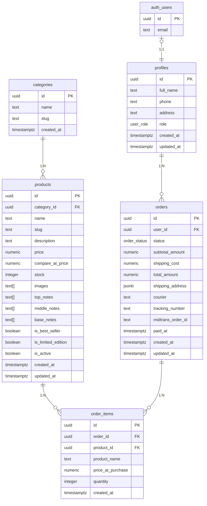
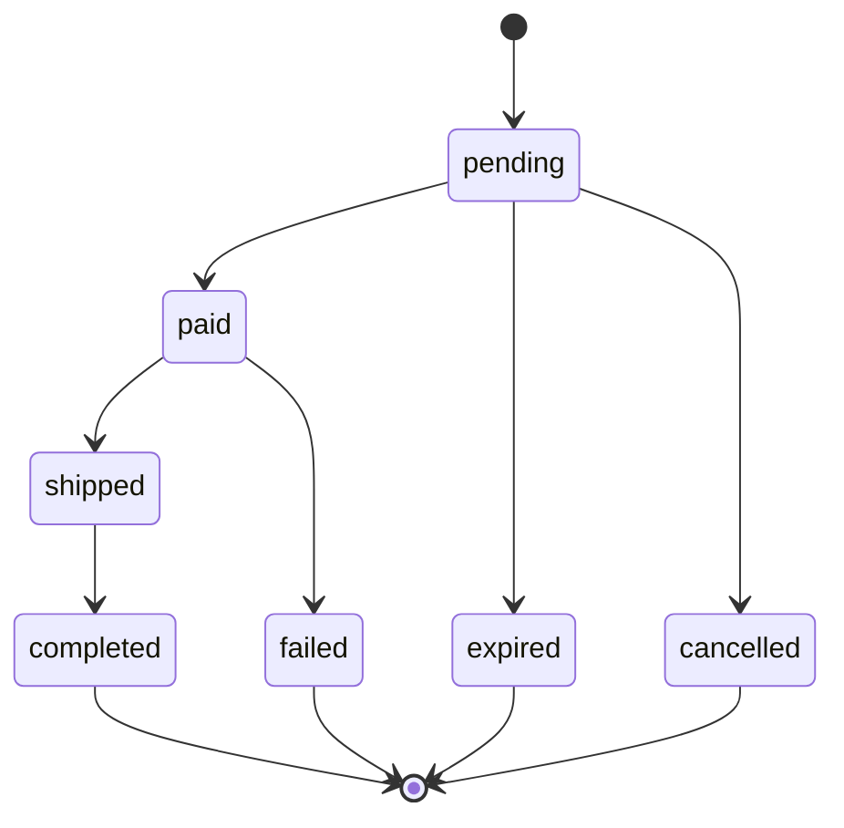

# Database Schema — Aurélia Fragrance

**Platform:** Supabase PostgreSQL
**Migration:** `supabase/migrations/20260617120000_init_schema.sql`
**Types:** `src/types/database.ts`

> Diagram ini menggunakan sintaks **Mermaid** — akan render otomatis sebagai diagram visual di GitHub, GitLab, atau VS Code (dengan ekstensi Mermaid).

---

## Entity Relationship Diagram (ERD)



### Legend Relasi

```
||--o{  1:N  (one to many)
|o--||  1:1  (one to one, optional)
```

---

## Entity Relationship Diagram (Text-based)

```
│   auth.users  │         (Supabase Auth, built-in)
│  ───────────  │
│ id (PK)       │──┐
│ email         │  │ 1:1
│               │  │
└───────────────┘  │
                   │
                   ▼
┌──────────────────────────────────┐
│            profiles              │
│  ──────────────────────────      │
│  id (PK, FK → auth.users)       │──┐
│  full_name          text         │  │
│  phone              text         │  │ 1:N
│  address            text         │  │
│  role               enum         │  │ (customer | admin)
│  created_at         timestamptz  │  │
│  updated_at         timestamptz  │  │
└──────────────────────────────────┘  │
                                      │
                                      ▼
┌──────────────────────────────────────┐
│              orders                  │
│  ─────────────────────────────       │
│  id (PK)                uuid        │──┐
│  user_id (FK → profiles)            │  │
│  status                 enum        │  │ 1:N
│  subtotal_amount        numeric     │  │
│  shipping_cost          numeric     │  │
│  total_amount           numeric     │  │
│  shipping_address       jsonb       │  │
│  courier                text        │  │
│  tracking_number        text        │  │
│  midtrans_order_id      text        │  │
│  paid_at                timestamptz │  │
│  created_at             timestamptz  │  │
│  updated_at             timestamptz  │  │
└──────────────────────────────────────┘  │
                                          │
                                          ▼
┌──────────────────────────────────────────┐
│              order_items                 │
│  ──────────────────────────────          │
│  id (PK)                 uuid           │
│  order_id (FK → orders)                 │
│  product_id (FK → products, SET NULL)   │
│  product_name            text           │ (snapshot)
│  price_at_purchase       numeric        │ (snapshot)
│  quantity                integer        │
│  created_at              timestamptz    │
└──────────────────────────────────────────┘
                    │
                    │ N:1 (SET NULL)
                    ▼
┌──────────────────────────────────────────┐
│               products                   │
│  ──────────────────────────────          │
│  id (PK)                 uuid           │──┐
│  category_id (FK → categories,          │  │
│               SET NULL)                  │  │
│  name                    text            │  │ N:1
│  slug                    text (unique)   │  │
│  description             text            │  │
│  price                   numeric         │  │
│  compare_at_price        numeric         │  │
│  stock                   integer         │  │
│  images                  text[]          │  │
│  top_notes               text[]          │  │
│  middle_notes            text[]          │  │
│  base_notes              text[]          │  │
│  is_best_seller          boolean         │  │
│  is_limited_edition      boolean         │  │
│  is_active               boolean         │  │
│  created_at              timestamptz     │  │
│  updated_at              timestamptz     │  │
└──────────────────────────────────────────┘  │
                    │                         │
                    │ N:1 (SET NULL)          │
                    ▼                         │
┌──────────────────────┐                     │
│     categories       │◄─────────────────────┘
│  ────────────────    │
│  id (PK)    uuid     │
│  name       text     │
│  slug       text     │
│  created_at          │
└──────────────────────┘
```

---

## Detail Tabel

### `categories`
Kategori produk (Floral, Oriental, Fresh, Woody, Gift Sets).

| Kolom | Tipe | Constraints | Keterangan |
|-------|------|-------------|-----------|
| id | `uuid` | PK, `gen_random_uuid()` | |
| name | `text` | NOT NULL | Nama kategori |
| slug | `text` | NOT NULL, UNIQUE | Slug untuk URL |
| created_at | `timestamptz` | NOT NULL, `now()` | |

**RLS:** Public SELECT, Admin ALL

---

### `products`
Produk parfum dengan pyramid notes (top/middle/base notes).

| Kolom | Tipe | Constraints | Keterangan |
|-------|------|-------------|-----------|
| id | `uuid` | PK | |
| category_id | `uuid` | FK → categories(id) ON DELETE SET NULL | |
| name | `text` | NOT NULL | |
| slug | `text` | NOT NULL, UNIQUE | |
| description | `text` | | |
| price | `numeric(12,2)` | NOT NULL, CHECK >= 0 | |
| compare_at_price | `numeric(12,2)` | CHECK >= price | Harga coret (diskon) |
| stock | `integer` | NOT NULL DEFAULT 0, CHECK >= 0 | |
| images | `text[]` | NOT NULL DEFAULT '{}' | Array URL gambar |
| top_notes | `text[]` | NOT NULL DEFAULT '{}' | Aroma atas |
| middle_notes | `text[]` | NOT NULL DEFAULT '{}' | Aroma tengah |
| base_notes | `text[]` | NOT NULL DEFAULT '{}' | Aroma dasar |
| is_best_seller | `boolean` | NOT NULL DEFAULT false | |
| is_limited_edition | `boolean` | NOT NULL DEFAULT false | |
| is_active | `boolean` | NOT NULL DEFAULT true | Soft delete flag |
| created_at | `timestamptz` | NOT NULL DEFAULT now() | |
| updated_at | `timestamptz` | NOT NULL DEFAULT now() | Auto-update via trigger |

**Indexes:**
- `idx_products_category` ON category_id
- `idx_products_best_seller` ON is_best_seller WHERE is_best_seller = true
- `idx_products_limited_edition` ON is_limited_edition WHERE is_limited_edition = true
- `idx_products_active` ON is_active WHERE is_active = true

**RLS:** Public SELECT (active only), Admin ALL

---

### `profiles`
Data profil user, terhubung 1:1 dengan `auth.users`.

| Kolom | Tipe | Constraints | Keterangan |
|-------|------|-------------|-----------|
| id | `uuid` | PK, FK → auth.users(id) ON DELETE CASCADE | Sama dengan auth.users.id |
| full_name | `text` | | Auto-fill dari metadata registrasi |
| phone | `text` | | |
| address | `text` | | |
| role | `user_role` | NOT NULL DEFAULT 'customer' | `customer` atau `admin` |
| created_at | `timestamptz` | NOT NULL DEFAULT now() | |
| updated_at | `timestamptz` | NOT NULL DEFAULT now() | |

**Trigger:** `handle_new_user` — auto-insert profile saat user register di auth.users.

**RLS:** SELECT & UPDATE own profile or admin.

---

### `orders`
Pesanan yang dibuat oleh customer.

| Kolom | Tipe | Constraints | Keterangan |
|-------|------|-------------|-----------|
| id | `uuid` | PK | |
| user_id | `uuid` | FK → profiles(id) ON DELETE RESTRICT | |
| status | `order_status` | NOT NULL DEFAULT 'pending' | pending → paid → shipped → completed / failed / expired / cancelled |
| subtotal_amount | `numeric(12,2)` | NOT NULL DEFAULT 0 | |
| shipping_cost | `numeric(12,2)` | NOT NULL DEFAULT 0 | |
| total_amount | `numeric(12,2)` | NOT NULL DEFAULT 0 | |
| shipping_address | `jsonb` | NOT NULL | `{recipient_name, phone, address_line, city, province, postal_code}` |
| courier | `text` | | Diisi admin saat Ship |
| tracking_number | `text` | | Nomor resi |
| midtrans_order_id | `text` | UNIQUE | ID dari Midtrans |
| paid_at | `timestamptz` | | Timestamp pembayaran |
| created_at | `timestamptz` | NOT NULL DEFAULT now() | |
| updated_at | `timestamptz` | NOT NULL DEFAULT now() | |

**Indexes:** `idx_orders_user` ON user_id, `idx_orders_status` ON status.

**RLS:** SELECT own or admin, INSERT own, UPDATE admin only.

---

### `order_items`
Item dalam pesanan (snapshot data produk saat pembelian).

| Kolom | Tipe | Constraints | Keterangan |
|-------|------|-------------|-----------|
| id | `uuid` | PK | |
| order_id | `uuid` | FK → orders(id) ON DELETE CASCADE | |
| product_id | `uuid` | FK → products(id) ON DELETE SET NULL | NULL jika produk dihapus |
| product_name | `text` | NOT NULL | Snapshot nama produk |
| price_at_purchase | `numeric(12,2)` | NOT NULL, CHECK >= 0 | Snapshot harga |
| quantity | `integer` | NOT NULL, CHECK > 0 | |
| created_at | `timestamptz` | NOT NULL DEFAULT now() | |

**Indexes:** `idx_order_items_order` ON order_id, `idx_order_items_product` ON product_id.

**RLS:** SELECT own or admin, INSERT own.

---

## Enum Types

### `user_role`
```sql
CREATE TYPE public.user_role AS ENUM ('customer', 'admin');
```

### `order_status`
```sql
CREATE TYPE public.order_status AS ENUM (
  'pending', 'paid', 'shipped', 'completed', 'failed', 'expired', 'cancelled'
);
```

**State Flow:**



---

## Row Level Security (RLS) Policies

| Tabel | Policy | Operasi | Target | Logika |
|-------|--------|---------|--------|--------|
| **categories** | `select_public` | SELECT | Public | `true` |
| | `admin_all` | ALL | Admin | `is_admin()` |
| **products** | `select_public` | SELECT | Public | `is_active = true OR is_admin()` |
| | `admin_insert` | INSERT | Admin | `is_admin()` |
| | `admin_update` | UPDATE | Admin | `is_admin()` |
| | `admin_delete` | DELETE | Admin | `is_admin()` |
| **profiles** | `select_own_or_admin` | SELECT | Own/Admin | `auth.uid() = id OR is_admin()` |
| | `update_own_or_admin` | UPDATE | Own/Admin | `auth.uid() = id OR is_admin()` |
| **orders** | `select_own_or_admin` | SELECT | Own/Admin | `auth.uid() = user_id OR is_admin()` |
| | `insert_own` | INSERT | Own | `auth.uid() = user_id` |
| | `update_admin_only` | UPDATE | Admin | `is_admin()` |
| **order_items** | `select_own_or_admin` | SELECT | Own/Admin | `is_admin() OR order.user_id = auth.uid()` |
| | `insert_own` | INSERT | Own | `order.user_id = auth.uid()` |

**Storage Bucket `product-images`:**
- INSERT: Admin only
- SELECT: Public
- UPDATE: Admin only
- DELETE: Admin only

---

## Ringkasan Relasi

| Relasi | Tipe | Source | Target | On Delete |
|--------|------|--------|--------|-----------|
| User → Profile | 1:1 | `auth.users.id` | `profiles.id` | CASCADE |
| Category → Product | 1:N | `categories.id` | `products.category_id` | SET NULL |
| Profile → Order | 1:N | `profiles.id` | `orders.user_id` | RESTRICT |
| Order → Order Item | 1:N | `orders.id` | `order_items.order_id` | CASCADE |
| Product → Order Item | 1:N | `products.id` | `order_items.product_id` | SET NULL |
