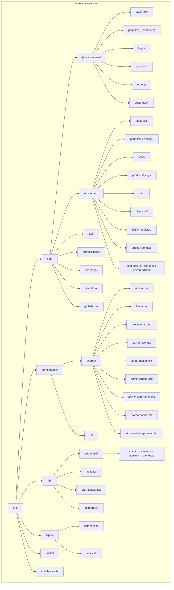

# Directory Tree — Aurélia Fragrance

> Diagram berikut akan render otomatis di GitHub. Gunakan `npm run dev` untuk menjalankan project.



---

## Directory Tree (Text)

```
aurelia-fragrance/
├── .env.local
├── .env.local.example
├── .eslintrc.json
├── .gitignore
├── .prettierrc
├── components.json
├── design.md
├── next-env.d.ts
├── next.config.mjs
├── package-lock.json
├── package.json
├── plan.md
├── postcss.config.mjs
├── tailwind.config.ts
├── tsconfig.json
├── README.md
│
├── public/
│
├── supabase/
│   ├── migrations/
│   │   └── 20260617120000_init_schema.sql
│   ├── seed.sql
│   └── storage-policies.sql
│
├── docs/
│   ├── directory-tree.md
│   └── database-schema.md
│
├── node_modules/
│
└── src/
    ├── middleware.ts
    │
    ├── app/
    │   ├── globals.css
    │   ├── layout.tsx
    │   │
    │   ├── (admin)/
    │   │   └── admin/
    │   │       ├── layout.tsx
    │   │       ├── page.tsx                          # Dashboard overview
    │   │       ├── login/
    │   │       │   └── page.tsx
    │   │       ├── products/
    │   │       │   ├── page.tsx                      # List produk
    │   │       │   ├── delete-button.tsx
    │   │       │   ├── [id]/
    │   │       │   │   └── edit/
    │   │       │   │       └── page.tsx              # Edit produk
    │   │       │   └── new/
    │   │       │       └── page.tsx                  # Tambah produk
    │   │       ├── orders/
    │   │       │   ├── page.tsx                      # List order
    │   │       │   ├── [id]/
    │   │       │   │   ├── page.tsx                  # Detail order
    │   │       │   │   └── tracking-form.tsx
    │   │       └── customers/
    │   │           ├── page.tsx                      # List customer
    │   │           └── [id]/
    │   │               └── page.tsx                  # Detail customer
    │   │
    │   ├── (customer)/
    │   │   ├── layout.tsx
    │   │   ├── page.tsx                              # Landing page
    │   │   ├── about/
    │   │   │   └── page.tsx
    │   │   ├── best-sellers/
    │   │   │   └── page.tsx
    │   │   ├── cart/
    │   │   │   └── page.tsx
    │   │   ├── checkout/
    │   │   │   └── page.tsx
    │   │   ├── contact/
    │   │   │   └── page.tsx
    │   │   ├── gift-sets/
    │   │   │   └── page.tsx
    │   │   ├── limited-edition/
    │   │   │   └── page.tsx
    │   │   ├── login/
    │   │   │   └── page.tsx
    │   │   ├── products/
    │   │   │   └── [slug]/
    │   │   │       └── page.tsx                      # Detail produk
    │   │   ├── register/
    │   │   │   └── page.tsx
    │   │   └── shop/
    │   │       └── page.tsx
    │   │
    │   ├── api/
    │   │   ├── midtrans/
    │   │   │   └── webhook/
    │   │   │       └── route.ts
    │   │   └── payment/
    │   │       └── route.ts
    │   │
    │   ├── auth/
    │   │   └── callback/
    │   │       └── route.ts
    │   │
    │   └── order/
    │       └── [id]/
    │           └── page.tsx
    │
    ├── components/
    │   ├── shared/
    │   │   ├── add-to-cart-button.tsx
    │   │   ├── admin-sidebar.tsx
    │   │   ├── auth-provider.tsx
    │   │   ├── cart-drawer.tsx
    │   │   ├── feature-icon-item.tsx
    │   │   ├── footer.tsx
    │   │   ├── image-upload.tsx
    │   │   ├── navbar.tsx
    │   │   ├── product-card.tsx
    │   │   ├── promo-banner.tsx
    │   │   └── simulated-snap-popup.tsx
    │   └── ui/
    │       └── button.tsx                             # Shadcn/UI Button
    │
    ├── hooks/
    │
    ├── lib/
    │   ├── cart-context.tsx
    │   ├── midtrans.ts
    │   ├── products.ts
    │   ├── utils.ts
    │   ├── actions/
    │   │   ├── admin.ts
    │   │   └── checkout.ts
    │   └── supabase/
    │       ├── admin.ts                              # Service Role client
    │       ├── client.ts                             # Browser client
    │       ├── queries.ts                            # Server queries
    │       └── server.ts                             # SSR client
    │
    └── types/
        ├── css.d.ts
        ├── database.ts
        └── index.ts
```

## Route Map (Next.js App Router)

| URL | File | Type | Keterangan |
|-----|------|------|-----------|
| `/` | `(customer)/page.tsx` | SSR | Landing page (hero, best sellers, promo) |
| `/shop` | `(customer)/shop/page.tsx` | SSR | Katalog produk + filter + search |
| `/best-sellers` | `(customer)/best-sellers/page.tsx` | SSR | Produk best seller |
| `/gift-sets` | `(customer)/gift-sets/page.tsx` | SSR | Produk gift set |
| `/limited-edition` | `(customer)/limited-edition/page.tsx` | SSR | Produk limited edition |
| `/products/[slug]` | `(customer)/products/[slug]/page.tsx` | SSR | Detail produk |
| `/about` | `(customer)/about/page.tsx` | Static | Brand story |
| `/contact` | `(customer)/contact/page.tsx` | Static | Form kontak |
| `/login` | `(customer)/login/page.tsx` | CSR | Login customer |
| `/register` | `(customer)/register/page.tsx` | CSR | Register customer |
| `/cart` | `(customer)/cart/page.tsx` | CSR | Keranjang belanja |
| `/checkout` | `(customer)/checkout/page.tsx` | CSR | Checkout + payment |
| `/order/[id]` | `order/[id]/page.tsx` | SSR | Status order |
| `/admin` | `(admin)/admin/page.tsx` | CSR | Dashboard admin |
| `/admin/login` | `(admin)/admin/login/page.tsx` | CSR | Login admin |
| `/admin/products` | `(admin)/admin/products/page.tsx` | CSR | CRUD produk |
| `/admin/products/new` | `(admin)/admin/products/new/page.tsx` | CSR | Tambah produk |
| `/admin/products/[id]/edit` | `(admin)/admin/products/[id]/edit/page.tsx` | CSR | Edit produk |
| `/admin/orders` | `(admin)/admin/orders/page.tsx` | CSR | Manajemen order |
| `/admin/orders/[id]` | `(admin)/admin/orders/[id]/page.tsx` | CSR | Detail order |
| `/admin/customers` | `(admin)/admin/customers/page.tsx` | CSR | List customer |
| `/admin/customers/[id]` | `(admin)/admin/customers/[id]/page.tsx` | CSR | Detail customer |
| `/auth/callback` | `auth/callback/route.ts` | API | OAuth callback |
| `/api/payment` | `api/payment/route.ts` | API | Create Snap token |
| `/api/midtrans/webhook` | `api/midtrans/webhook/route.ts` | API | Webhook Midtrans |
